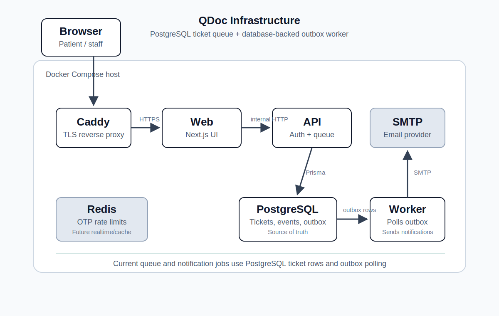

# QDoc

QDoc is a hackathon project for clinic check-in and queue operations. It helps walk-in patients check in before they arrive, track their ticket status, and receive a notification when their turn is close. It also gives clinic staff a lightweight queue board for calling patients, moving them into service, delaying late arrivals, restoring them to the front of the waiting queue, and completing or cancelling tickets.

## Project Description

### Problem

Walk-in clinic queues are often managed through front-desk conversations, phone calls, paper lists, or disconnected tools. Patients do not know whether one clinic has a much shorter line than another, and they can miss their turn if they leave the waiting area without a reliable status update. Staff also need a practical way to handle late patients without losing the original queue order or creating confusion for everyone still waiting.

### Solution

QDoc turns the clinic queue into a simple web workflow:

- Patients choose a clinic location, see current waiting counts and distance hints, sign in with email OTP, and check in to a queue.
- Patients can return to the app to see their active ticket, status changes, and in-app notifications.
- Staff sign in with the same OTP flow and use a site-scoped queue board to call, start service, complete, delay, restore, or cancel tickets.
- Status changes are recorded as ticket events, audit logs, notification logs, and outbox jobs so operational history and notification delivery are not tied only to the UI request.

### How It Was Built

QDoc is implemented as a production-shaped TypeScript monorepo:

- `apps/web`: Next.js App Router frontend for patient check-in and staff queue management.
- `apps/api`: Node HTTP API for OTP auth, sessions, patient check-in, active tickets, staff authorization, and ticket state transitions.
- `apps/worker`: background worker that polls the database outbox, claims pending jobs, sends almost-ready emails, and retries failed work.
- `packages/contracts`: shared Zod schemas and TypeScript types used by both web and API code.
- `packages/db`: Prisma schema, migrations, seed data, and Prisma client access.
- `packages/config`, `packages/ui`: shared TypeScript config and UI package scaffolding.

### Architecture



QDoc is deployed as a small Docker Compose stack with Caddy as the public reverse proxy, a Next.js web app, a Node API server, PostgreSQL, Redis, and a background worker. The waiting queue is backed by ticket rows in PostgreSQL, while notification jobs use a database-backed outbox that the worker polls and processes. Redis is provisioned in the runtime for future realtime, cache, or coordination work, but it is not on the current queue or notification processing path.

The core database model includes organizations, clinic sites, queues, users, staff memberships, OTP challenges, tickets, ticket events, notification logs, outbox rows, and audit logs. Ticket ordering uses a `sortRank` field instead of only `createdAt`, which lets a delayed patient be restored to the front of the waiting queue in a controlled way.

### Challenges

- Keeping the scope small enough for a hackathon while still building an end-to-end vertical slice with separate web, API, worker, database, contracts, and deployment structure.
- Making ticket transitions safe so staff actions cannot move a ticket from an invalid state, such as completing a ticket that was never started.
- Supporting late-arrival handling without breaking queue fairness. The `delay` and `restore` flow required explicit ordering logic and DB indexes.
- Decoupling notification work from staff API requests. The outbox pattern keeps status changes durable even if email delivery fails and needs retry.
- Protecting patient privacy on the staff board by masking patient emails while still giving staff enough context to operate the queue.

### What's Next

- Add real distance and travel-time estimates instead of seeded distance values.
- Add SMS/push notifications and more configurable notification thresholds.
- Replace polling with SSE for faster live queue updates.
- Add richer staff roles, queue closing controls, and multi-department clinic support.
- Add Playwright end-to-end tests for the patient and staff flows.
- Add observability dashboards for queue wait times, notification failures, and staff actions.
- Integrate with clinic EMR/EHR systems after the core queue workflow is stable.

## Tech Stack

- TypeScript, pnpm workspace, Turborepo
- Next.js 15, React 19, Tailwind CSS, lucide-react
- Node HTTP API with shared Zod contracts
- PostgreSQL, Prisma, Prisma migrations and seed data
- Database-backed outbox worker with SMTP or console email delivery
- Docker Compose for local PostgreSQL and Redis
- Docker/Caddy staging deployment files

## Core Flows

Patient flow:

1. Open the patient app.
2. Select a clinic and queue.
3. Sign in with email OTP.
4. Check in.
5. Watch the active ticket panel update by polling.
6. Receive in-app and email notifications when the ticket is close to being called.

Staff flow:

1. Open `/staff`.
2. Sign in with the seeded staff account.
3. Select a staffed site.
4. Move tickets through call, start service, complete, delay, restore, or cancel actions.
5. Each ticket state change writes `ticket_event`, `audit_log`, `notification_log`, and `outbox` records.

Worker flow:

1. Staff ticket actions create pending outbox rows.
2. `apps/worker` claims pending or stale processing rows.
3. The worker marks rows as `processed`, retries failed rows with backoff, or marks them `failed` after max attempts.

## Local Setup

```bash
pnpm install
cp .env.example .env
docker compose up -d --wait
pnpm db:migrate
pnpm db:seed
```

The compose file binds PostgreSQL and Redis to localhost only. Default ports from `.env.example` are:

- PostgreSQL: `127.0.0.1:55432`
- Redis: `127.0.0.1:56379`
- API: `127.0.0.1:4000`

If local development data can be discarded, reset and replay all migrations with:

```bash
pnpm exec dotenv -e .env -- pnpm --filter @qdoc/db exec prisma migrate reset --schema prisma/schema.prisma --force --skip-seed
pnpm db:seed
```

## Running Locally

Run individual processes in separate terminals:

```bash
pnpm dev:api
pnpm dev:web
pnpm dev:worker
```

Useful URLs:

- Patient app: `http://localhost:3000`
- Staff queue board: `http://localhost:3000/staff`
- API health: `http://127.0.0.1:4000/health`

If port `3000` is already in use, Next.js will choose another local port and print it in the terminal.

OTP delivery is console-based in local development. When signing in, read the verification code from the API server logs.

Seed data:

- Staff account: `staff@example.com`
- Waterloo Clinic: `site-waterloo`, `queue-waterloo-walkin`, 19 waiting tickets
- Kitchener Clinic: `site-kitchener`, `queue-kitchener-walkin`, 5 waiting tickets
- Dental Clinic: `site-university`, `queue-university-walkin`, 0 waiting tickets

## Verification

Run the standard checks:

```bash
pnpm typecheck
pnpm lint
pnpm build
pnpm db:validate
pnpm verify:outbox
```

`pnpm verify:outbox` creates scoped verification rows, runs the worker outbox processor against those rows only, checks processed/retry/failed transitions, and removes the rows it created.
