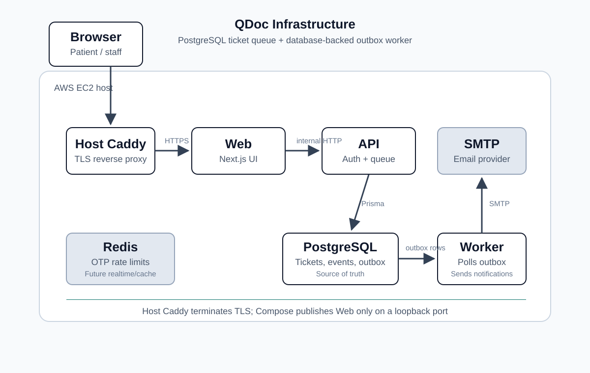

# QDoc

QDoc is a hackathon project for clinic check-in and queue operations. It helps walk-in patients check in before they arrive, track their ticket status, and receive a notification when their turn is close. It also gives clinic staff a lightweight queue board for calling patients, moving them into service, delaying late arrivals, restoring them to the front of the waiting queue, and completing or cancelling tickets.

## Project Description

### Problem

Walk-in clinic queues are often managed through front-desk conversations, phone calls, paper lists, or disconnected tools. Patients do not know whether one clinic has a much shorter line than another, and they can miss their turn if they leave the waiting area without a reliable status update. Staff also need a practical way to handle late patients without losing the original queue order or creating confusion for everyone still waiting.

### Solution

QDoc turns the clinic queue into a simple web workflow:

- Patients choose a clinic location, see current waiting counts and distance hints, sign in with email OTP, and check in to a queue.
- Patients can return to the app to see their active ticket, status changes, and in-app notifications.
- Staff sign in with the same OTP flow and use a site-scoped queue board to call, start service, complete, delay, restore, or cancel tickets.
- Status changes are recorded as ticket events, audit logs, notification logs, and outbox jobs so operational history and notification delivery are not tied only to the UI request.

### How It Was Built

QDoc is implemented as a production-shaped TypeScript monorepo:

- `apps/web`: Next.js App Router frontend for patient check-in and staff queue management.
- `apps/api`: Node HTTP API for OTP auth, sessions, patient check-in, active tickets, staff authorization, and ticket state transitions.
- `apps/worker`: background worker that polls the database outbox, claims pending jobs, sends almost-ready emails, and retries failed work.
- `packages/contracts`: shared Zod schemas and TypeScript types used by both web and API code.
- `packages/db`: Prisma schema, migrations, seed data, and Prisma client access.
- `packages/config`, `packages/ui`: shared TypeScript config and UI package scaffolding.

### Architecture



QDoc is deployed on a small EC2 instance behind host-level Caddy. GitHub Actions builds the application image, uploads the compressed image artifact to S3, and triggers Systems Manager Run Command so the host only downloads and runs the image. The Docker Compose stack runs the Next.js web app, Node API server, PostgreSQL, Redis, migration/seed jobs, and a background worker; only the web app is published to the host loopback interface for Caddy to proxy. The waiting queue is backed by ticket rows in PostgreSQL, while notification jobs use a database-backed outbox that the worker polls and processes. Redis is used for OTP abuse-control counters and remains available for future realtime, cache, or coordination work.

The core database model includes organizations, clinic sites, queues, users, staff memberships, OTP challenges, tickets, ticket events, notification logs, outbox rows, and audit logs. Ticket ordering uses a `sortRank` field instead of only `createdAt`, which lets a delayed patient be restored to the front of the waiting queue in a controlled way.

### Challenges

- Keeping the scope small enough for a hackathon while still building an end-to-end vertical slice with separate web, API, worker, database, contracts, and deployment structure.
- Making ticket transitions safe so staff actions cannot move a ticket from an invalid state, such as completing a ticket that was never started.
- Supporting late-arrival handling without breaking queue fairness. The `delay` and `restore` flow required explicit ordering logic and DB indexes.
- Decoupling notification work from staff API requests. The outbox pattern keeps status changes durable even if email delivery fails and needs retry.
- Protecting patient privacy on the staff board by masking patient emails while still giving staff enough context to operate the queue.

### What's Next

- Add real distance and travel-time estimates instead of seeded distance values.
- Add SMS/push notifications and more configurable notification thresholds.
- Replace polling with SSE for faster live queue updates.
- Add richer staff roles, queue closing controls, and multi-department clinic support.
- Expand Playwright coverage for edge cases such as closed queues, duplicate check-ins, and cancelled tickets.
- Add observability dashboards for queue wait times, notification failures, and staff actions.
- Integrate with clinic EMR/EHR systems after the core queue workflow is stable.

## Tech Stack

- TypeScript, pnpm workspace, Turborepo
- Next.js 15, React 19, Tailwind CSS, lucide-react
- Node HTTP API with shared Zod contracts
- PostgreSQL, Prisma, Prisma migrations and seed data
- Database-backed outbox worker with SMTP or local console email delivery
- Docker Compose for local PostgreSQL and Redis
- Docker Compose staging deployment behind host Caddy
- GitHub Actions, S3, and AWS Systems Manager for external image build and low-resource host deployment

## Core Flows

Patient flow:

1. Open the patient app.
2. Select a clinic and queue.
3. Sign in with email OTP.
4. Check in.
5. Watch the active ticket panel update by polling.
6. Receive in-app and email notifications when the ticket is close to being called.

Staff flow:

1. Open `/staff`.
2. Sign in with the seeded staff account.
3. Select a staffed site.
4. Move tickets through call, start service, complete, delay, restore, or cancel actions.
5. Each ticket state change writes `ticket_event`, `audit_log`, `notification_log`, and `outbox` records.

Worker flow:

1. Staff ticket actions create pending outbox rows.
2. `apps/worker` claims pending or stale processing rows.
3. The worker marks rows as `processed`, retries failed rows with backoff, or marks them `failed` after max attempts.

OTP abuse controls:

1. OTP request and verification attempts keep the existing in-process cooldowns.
2. When `REDIS_URL` is configured, API adds Redis TTL counters for email, client IP, and client IP plus email combinations.
3. Redis keys use hashed identifiers instead of raw email addresses.

## Local Setup

```bash
pnpm install
cp .env.example .env
docker compose up -d --wait
pnpm db:migrate
pnpm db:seed
```

The compose file binds PostgreSQL and Redis to localhost only. Default ports from `.env.example` are:

- PostgreSQL: `127.0.0.1:55432`
- Redis: `127.0.0.1:56379`
- API: `127.0.0.1:4000`

If local development data can be discarded, reset and replay all migrations with:

```bash
pnpm exec dotenv -e .env -- pnpm --filter @qdoc/db exec prisma migrate reset --schema prisma/schema.prisma --force --skip-seed
pnpm db:seed
```

## Running Locally

Run individual processes in separate terminals:

```bash
pnpm dev:api
pnpm dev:web
pnpm dev:worker
```

Useful URLs:

- Patient app: `http://localhost:3000`
- Staff queue board: `http://localhost:3000/staff`
- API health: `http://127.0.0.1:4000/health`

If port `3000` is already in use, Next.js will choose another local port and print it in the terminal.

OTP delivery is console-based in local development. When signing in, read the verification code from the API server logs.

Seed data:

- Staff account: `staff@example.com`
- Waterloo Clinic: `site-waterloo`, `queue-waterloo-walkin`, 19 waiting tickets
- Kitchener Clinic: `site-kitchener`, `queue-kitchener-walkin`, 5 waiting tickets
- Dental Clinic: `site-university`, `queue-university-walkin`, 0 waiting tickets

## Verification

Run the standard checks:

```bash
pnpm typecheck
pnpm lint
pnpm build
pnpm db:validate
pnpm verify:outbox
pnpm verify:ops
pnpm e2e
```

`pnpm verify:outbox` creates scoped verification rows, runs the worker outbox processor against those rows only, checks processed/retry/failed transitions, and removes the rows it created.

`pnpm verify:ops` prints safe operational JSON for outbox status counts, oldest pending job age, failed almost-ready email jobs, active ticket counts, and current map guardrail state. It exits non-zero when failed outbox jobs, stale processing jobs, failed email jobs, or enabled map guardrail misconfiguration need operator attention.

Install the Playwright Chromium browser once before running E2E tests locally:

```bash
pnpm e2e:install
```

`pnpm e2e` starts the API and web dev servers with a test-only fixed OTP, resets isolated E2E rows in the local database, and verifies patient OTP login, check-in, active ticket status updates, staff OTP login, call/start/complete, and delay/restore. The fixed OTP is enabled only inside the Playwright `webServer` environment with `APP_ENV=test`, `EMAIL_PROVIDER=console`, and `ALLOW_FIXED_OTP=true`; normal local, staging, and production runs still use the configured environment. E2E refuses to run against a non-local `DATABASE_URL` unless `QDOC_ALLOW_E2E_REMOTE_DB=true` is explicitly set for an isolated test database.

Manual core-flow staging checklist:

1. Patient requests an email OTP, signs in, selects a clinic queue, checks in, and sees an active ticket.
2. Staff signs in at `/staff` with a seeded staff account and can see the same site queue.
3. Staff calls the patient ticket, starts service, and completes it; the patient status panel reflects each state change after polling.
4. Staff delays a waiting ticket and restores it; the restored ticket returns to the front of the waiting queue.
5. Worker logs show outbox jobs being processed, or `QDOC_VERIFY_OUTBOX=true bash deploy/verify-staging.sh` passes against staging.

## AWS EC2 Staging Deployment

The staging setup assumes another host-level Caddy process already owns public ports `80` and `443`. QDoc should not start its own public Caddy container on that host. The EC2 instance is intentionally kept out of the build path: GitHub Actions builds the Docker image, stores it in S3, and asks Systems Manager to run the host-side deployment script.

Host networking:

- DNS: point the staging domain to the EC2 public IPv4 address, preferably an Elastic IP.
- Security group: allow inbound `80` and `443` from the internet, allow inbound `22` only from the operator's public IP if SSH is still needed, and do not expose the web loopback port, API, PostgreSQL, or Redis publicly.
- Host Caddy: add the QDoc virtual host to `/etc/caddy/Caddyfile` and proxy it to the web container loopback port. Either replace the placeholders before saving the file or set matching Caddy environment variables:

```caddy
{$APP_DOMAIN} {
  encode zstd gzip
  reverse_proxy 127.0.0.1:{$QDOC_WEB_PORT}
}
```

- Compose: `compose.staging.yaml` publishes only `web` to `127.0.0.1:${QDOC_WEB_PORT}`. API, PostgreSQL, Redis, worker, migrate, and seed remain on the private Docker network.
- Environment: set `APP_DOMAIN`, `APP_URL`, `QDOC_APP_IMAGE`, `QDOC_WEB_BIND=127.0.0.1`, `QDOC_WEB_PORT`, SMTP credentials, `SESSION_SECRET`, `QDOC_DB_SECRET`, and a matching `DATABASE_URL` in `.env.staging`.

Staging environment variables:

| Variable | Required | Notes |
| --- | --- | --- |
| `APP_DOMAIN` | yes | Public hostname served by host Caddy. |
| `APP_URL` | yes | Public origin, for example `https://qdoc.example.com`. |
| `APP_ENV` | yes | Use `staging` for staging. |
| `QDOC_APP_IMAGE` | yes | Docker image tag loaded from the S3 artifact, normally `qdoc-app:<git-sha>`. |
| `QDOC_WEB_BIND` | yes | Must remain `127.0.0.1`; the deploy script rejects public binds. |
| `QDOC_WEB_PORT` | yes | Host loopback port Caddy proxies to, for example `13000`. |
| `DATABASE_URL` | yes | Internal PostgreSQL URL matching the Compose database service. |
| `POSTGRES_DB`, `POSTGRES_USER`, `QDOC_DB_SECRET` | yes | PostgreSQL bootstrap settings. |
| `REDIS_URL` | yes | Internal Redis URL used for OTP rate-limit counters. |
| `SESSION_SECRET` | yes | Long random secret; never commit the value. |
| `EMAIL_PROVIDER` | yes | Use `smtp` for staging unless console delivery is explicitly allowed. |
| `EMAIL_FROM`, `SMTP_HOST`, `SMTP_PORT`, `SMTP_SECURE`, `SMTP_USER`, `SMTP_PASS` | yes for SMTP | SMTP sender and credentials; never print or commit secrets. |
| `ALLOW_CONSOLE_OTP`, `ALLOW_FIXED_OTP` | yes | Keep both `false` in normal staging. |
| `WORKER_POLL_INTERVAL_MS`, `WORKER_OUTBOX_BATCH_SIZE`, `WORKER_OUTBOX_MAX_ATTEMPTS` | no | Optional worker tuning values. |
| `MAP_PROVIDER`, `MAP_PROVIDER_ENABLED`, `MAP_MONTHLY_MAP_LOAD_LIMIT` | no | Optional map provider selection and QDoc monthly hard-stop budget. Leave disabled until provider restrictions and limits are configured. |
| `MAP_SETTINGS_ADMIN_EMAILS` | no | Comma-separated operator email allowlist for changing global map budget settings from the staff UI. Leave empty unless an operator should manage cost guardrails. |
| `MAPBOX_PUBLIC_TOKEN`, `GOOGLE_MAPS_BROWSER_KEY` | no | Browser credentials returned only when QDoc map guardrails allow loading; restrict them in the provider console. |
| `MAP_USAGE_RATE_LIMIT_PER_MINUTE`, `MAP_USAGE_RATE_LIMIT_PER_HOUR` | no | Optional per-requester rate limits before map usage reservations are accepted. |

GitHub staging environment settings:

| Name | Type | Notes |
| --- | --- | --- |
| `AWS_REGION` | variable | Region for S3 and Systems Manager. |
| `QDOC_SSM_DOCUMENT_NAME` | variable | Optional; defaults to `QDoc-StagingDeploy`. |
| `AWS_DEPLOY_ROLE_ARN` | secret | OIDC role assumed by GitHub Actions. |
| `QDOC_DEPLOY_BUCKET` | secret | Private S3 artifact bucket. |
| `QDOC_STAGING_INSTANCE_ID` | secret | EC2 managed-instance ID used by SSM. |

Apply Caddy changes:

```bash
sudo caddy fmt --overwrite /etc/caddy/Caddyfile
sudo caddy validate --config /etc/caddy/Caddyfile
sudo systemctl reload caddy
```

One-time AWS setup for S3 + Systems Manager deployment:

- Create a private S3 bucket for deployment artifacts. Keep S3 Block Public Access enabled, enable server-side encryption, and add a lifecycle rule that expires old `staging/` artifacts.
- Attach an EC2 instance profile with `AmazonSSMManagedInstanceCore` and scoped `s3:GetObject` permission for the deployment artifact prefix.
- Confirm SSM Agent is running on the instance and the instance appears as a managed node in Systems Manager.
- Install Docker, Docker Compose, Git, gzip, sha256sum, flock, AWS CLI, and Caddy on the EC2 host. Use a Docker Compose version that supports `up --wait`.
- Create a GitHub Actions OIDC IAM role scoped to this repository and branch. Grant it only the permissions required to upload the artifact and send/read the SSM command for the staging instance.
- Register the custom SSM command document from `deploy/ssm/qdoc-staging-deploy.yaml`. The workflow uses `QDoc-StagingDeploy` by default.
- Add GitHub environment secrets `AWS_DEPLOY_ROLE_ARN`, `QDOC_DEPLOY_BUCKET`, and `QDOC_STAGING_INSTANCE_ID`; add environment variables `AWS_REGION` and optionally `QDOC_SSM_DOCUMENT_NAME`.

Create the SSM document once, then update it when `deploy/ssm/qdoc-staging-deploy.yaml` changes:

```bash
aws ssm create-document \
  --name QDoc-StagingDeploy \
  --document-type Command \
  --document-format YAML \
  --content file://deploy/ssm/qdoc-staging-deploy.yaml

aws ssm update-document \
  --name QDoc-StagingDeploy \
  --document-version '$LATEST' \
  --document-format YAML \
  --content file://deploy/ssm/qdoc-staging-deploy.yaml
```

Install or refresh the host-side deploy script. The EC2 checkout must be able to fetch the target commit, because the deploy script checks out the same source ref as the image tag before running Compose:

```bash
sudo mkdir -p /opt
sudo git clone <repository-url> /opt/qdoc
sudo chmod +x /opt/qdoc/deploy/deploy-from-s3.sh
```

Deploy manually through SSM if needed:

```bash
sudo /opt/qdoc/deploy/deploy-from-s3.sh s3://<artifact-bucket>/staging/<git-sha>/qdoc-app.tar.gz <git-sha> <git-sha> <artifact-sha256>
```

The deploy script runs as root through SSM, serializes deployments with a host lock, downloads `qdoc-app.tar.gz.sha256` from the same S3 prefix, verifies the image artifact against the workflow-provided digest before loading it into Docker, forces the web bind to loopback, and waits for Compose services to become healthy.

Verify the path before testing in a browser:

```bash
curl -I "http://127.0.0.1:${QDOC_WEB_PORT}"
curl -Iv https://qdoc.example.com
docker compose -f compose.staging.yaml --env-file .env.staging ps
docker compose -f compose.staging.yaml --env-file .env.staging logs -f web api worker
```

Or run the bundled staging verifier from the EC2 checkout:

```bash
QDOC_PUBLIC_URL=https://qdoc.example.com bash deploy/verify-staging.sh
QDOC_PUBLIC_URL=https://qdoc.example.com QDOC_VERIFY_OUTBOX=true bash deploy/verify-staging.sh
QDOC_PUBLIC_URL=https://qdoc.example.com QDOC_VERIFY_OUTBOX=true QDOC_VERIFY_OPS=true bash deploy/verify-staging.sh
```

The verifier checks the Compose service state, healthchecks for web/API/worker/PostgreSQL/Redis, the loopback web endpoint, API health and readiness from inside the private Compose network, and the public Caddy route when `QDOC_PUBLIC_URL` is set. `QDOC_VERIFY_OUTBOX=true` runs the scoped outbox processor verification against the staging database. `QDOC_VERIFY_OPS=true` runs the safe operational summary for queue, notification, outbox, and map guardrail state.

Useful SSM and host checks:

```bash
aws ssm list-command-invocations --command-id <command-id> --details
aws ssm get-command-invocation --command-id <command-id> --instance-id <instance-id>
docker compose -f compose.staging.yaml --env-file .env.staging ps
docker compose -f compose.staging.yaml --env-file .env.staging logs --tail=200 web api worker
curl -fsSI "http://127.0.0.1:${QDOC_WEB_PORT}"
curl -fsSI https://qdoc.example.com
```

Rollback:

1. Pick a previously verified 40-character Git SHA whose `staging/<sha>/qdoc-app.tar.gz` and `.sha256` files still exist in the private deployment bucket.
2. Confirm the EC2 checkout can fetch that SHA.
3. Re-run the SSM document with `artifactUri`, `imageTag`, `sourceRef`, and `expectedSha256` for the known-good artifact, or run `deploy/deploy-from-s3.sh` manually on the host with those four values.
4. Run `QDOC_PUBLIC_URL=https://qdoc.example.com bash deploy/verify-staging.sh`.
5. If the rollback crosses database migrations, check the migration contents first. The current MVP deploy path only runs forward Prisma deploy migrations and does not implement automatic down migrations.

Artifact retention:

- GitHub Actions keeps the compressed image workflow artifact for 3 days.
- Configure the private S3 bucket lifecycle to keep `staging/` artifacts for 14 days, with at least the last known-good artifact available until the next deploy is verified.
- The EC2 deploy script prunes unused Docker images after a successful Compose update, but rollback should use the S3 artifact as the source of truth.
- Keep database backup and restore procedures outside this repo until the operating AWS account and retention policy are finalized.

Deployment artifact review:

The single Docker image artifact is still acceptable for the MVP because web, API, worker, migrate, and seed are built from the same monorepo revision and the EC2 host performs no build work. Split artifacts can be revisited when independent service scaling, image size, rollout isolation, or separate security boundaries become more important than the added release orchestration.
